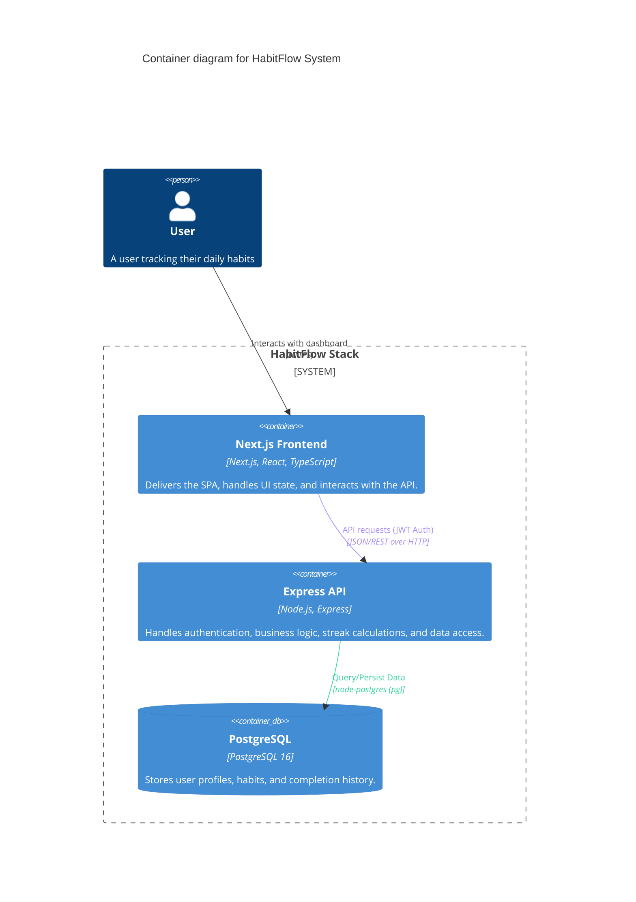

# Architecture Overview

This document illustrates the high-level system architecture of the HabitFlow application.

## System Topology 

The application is structured as a containerized Service-Oriented Architecture. It consists of a Next.js (React) Single Page Application interfacing with a Node.js Express REST API, with persistent storage provided by a PostgreSQL database. The entire stack is orchestrated via Docker Compose.

### C4 Container Diagram

## Component Interactivity & Data Flow

1. **Authentication**: Users must register/login to receive a JWT. This token is stored in the browser and included in the `Authorization` header for all subsequent API requests.
2. **Dashboard Hydration**: The frontend fetches user-specific habits via `GET /habits`. The backend joins the `habits` and `completed_dates` tables in PostgreSQL to compute streaks on-the-fly.
3. **Streak & Shield Logic**:
   - **Streaks**: Calculated by checking consecutive days in the database.
   - **Shields**: Users earn shields for maintaining long streaks. These can be manually activated via `PUT /habits/:id/shield` to protect a streak if a day was missed.
4. **Insights Engine**: The `GET /habits/insights` endpoint performs complex aggregations over the user's history to provide consistency scores and behavioral correlations.
5. **Deployment**: The `docker-compose.yml` file ensures that the database is healthy before the backend starts, providing a reliable development and production environment.
